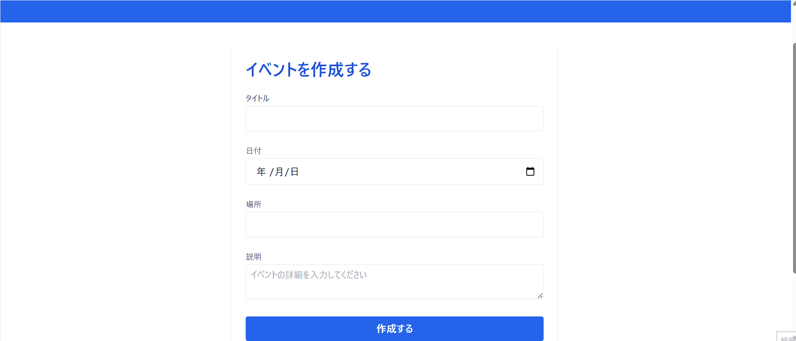
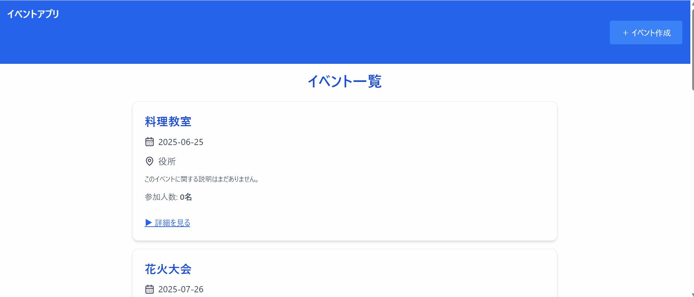

# 🌍 地域イベント管理アプリ

本アプリは、地域のイベントを「作成」「一覧表示」「詳細閲覧」「参加表明」できるシンプルな SPA です。
ユーザー登録なしで気軽にイベント情報を管理できるよう設計されています。

---

# 🔧 使用技術・ライブラリ

| 項目           | 内容                                         |
| -------------- | -------------------------------------------- |
| フレームワーク | [React](https://reactjs.org/) (Vite 構成)    |
| ルーティング   | [React Router DOM](https://reactrouter.com/) |
| CSS            | [Tailwind CSS](https://tailwindcss.com/)     |
| アイコン       | [Lucide React](https://lucide.dev/icons/)    |
| 状態管理       | React の `useState`, `useEffect` など        |
| 永続化         | ブラウザの `localStorage` を使用             |

---

# 🚀 セットアップ手順

このアプリケーションをローカル環境で動かすには、以下の手順を実行してください。

## 1. リポジトリをクローン

```bash
git clone https://github.com/imamachan/funrepeat_problem.git
cd funrepeat_problem
```

## 2. パッケージをインストール

```bash
npm install
```

## 3．開発サーバーを起動

```bash
npm run dev
```

ブラウザで http://localhost:5173 を開いて、アプリケーションが起動していることを確認してください。

---

# 💻 実施機能

| 機能             | 説明                                                                                                                           |
| ---------------- | ------------------------------------------------------------------------------------------------------------------------------ |
| イベント一覧表示 | 保存されたイベントをカード形式で一覧表示します。参加人数と参加済みステータスも表示。                                           |
| イベント詳細     | 各イベントの詳細画面を表示します。参加表明ボタンあり。                                                                         |
| イベント作成     | フォームからイベント情報を入力し、ローカルストレージに保存します。                                                             |
| 参加表明         | イベントに対して「参加する」「参加を取り消す」が可能です。                                                                     |
| レスポンシブ対応 | Tailwind の `sm:` `md:` などを使い、スマホ〜PC まで対応しています。                                                            |
| デザイン統一     | 優しいカラーパレット、行間・文字サイズの調整、カード UI、Lucide アイコンなどを活用し、シンプルで見やすい UI を実現しています。 |

---

# 🧪 動作確認方法



1. ブラウザでトップページを開く（例: http://localhost:5173/）

2. 「イベント作成」ボタンからイベントを作成
   タイトル、日時、場所は空欄で作成不可

3. 一覧にイベントが表示されることを確認



4. イベントカードの「詳細を見る」から詳細画面に遷移

5. 「参加する」ボタンを押して、参加表明が反映されるか確認

6. 一覧ページに戻り、参加済みラベルが表示されていることを確認

---
